# 编程第一步 - 从零开始的 VSCode 安装与 C/C++ 开发环境配置完全指南

## 写在前面

欢迎各位 $\color{red}{新兵蛋子}$ 来到你们编程的第一站。今天的你将从什么都不会的麻瓜毕业，从代码开始第一次运行一个简单的C语言程序。

鲁迅说过，“工欲善其事，必先利其器”。要想快速上手编程，还需要一件趁手的“兵器”。

于是大佬们就创造了 $\color{blue}{IDE}$（集成开发环境，Integrated Development Environment）。简单来说，IDE 把代码编辑器、编译器、调试器和构建工具打包在一起，让开发者不必在多个工具之间来回切换。IDE 出现之前，程序猿用记事本敲代码，通过命令行调用编译器，再摸索着 GDB 调试。好吧，虽然这些技能迟早要学，但作为起步，一个顺手的 IDE 能让你把精力集中在“写代码”本身，而不是“配置工具”上。

这份文档将带你从零开始，一步步完成 IDE 的安装以及相关的配置。

本文档介绍的 IDE 有仨：
- Visual Studio Code （以下简称vscode）
- Codeblocks （上机课最常用的 IDE）
- Trae （字节开发的 AI 编程助手，以 vscode 插件的形式）

## vscode 篇

### 软件的下载与安装

#### vscode

**vscode 是微软推出的一款免费、开源的轻量级代码编辑器**，凭借跨平台兼容、*海量的插件生态*和流畅的编辑体验，成为全球开发者使用率最高的编程工具之一。

##### 下载

先到官网下载 vscode 的安装包：[https://code.visualstudio.com](https://code.visualstudio.com)

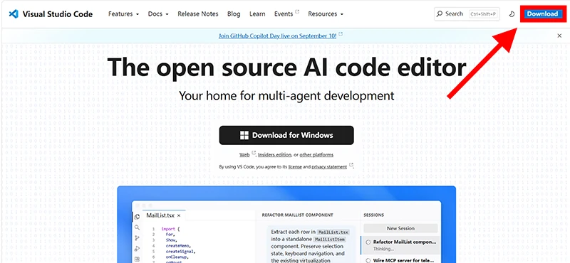

根据你的系统选择对应的安装包（我们以 windows11 为例）

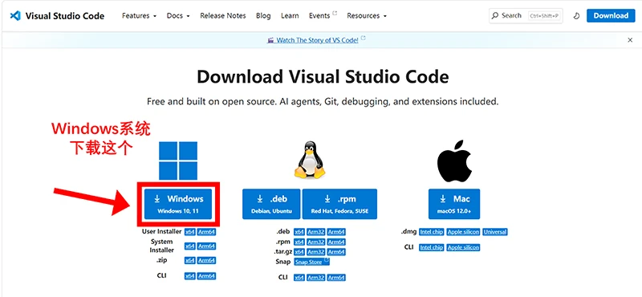

##### 安装

双击运行 `VSCodeUserSetup-x64-1.137.0.exe`

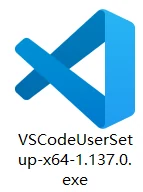

按照向导逐步操作。有几个关键选项需要注意：
- 安装位置：我们建议按照默认，安装在 C 盘。当然你电脑 C 盘需要有足够的空间。
- 添加到 PATH：务必勾选。
- 建议勾选“创建桌面快捷方式”，方便日后使用。
- 点击「安装」，等待完成。

#### msys2 与 MinGW-W64

**msys2** 是 Windows 平台上的类 Unix 开发环境套件，提供了完整的终端环境与 Pacman 包管理器，可以一键安装各类开发工具；

**MinGW-W64** 是基于 MSYS2 分发的 GCC 编译工具链，包含 gcc（C 语言编译器）、g++（C++ 编译器）与 gdb（调试器），是 Windows 下免费搭建 C/C++ 开发环境的核心组件。

##### msys2 下载

我们可以到 msys2 的 github 项目 release 页面下载：[https://github.com/msys2/msys2-installer/releases/](https://github.com/msys2/msys2-installer/releases/)

选择 `msys2-x86_64-20260611.exe`（前缀是 msys2-x86_64，后面是日期），下载

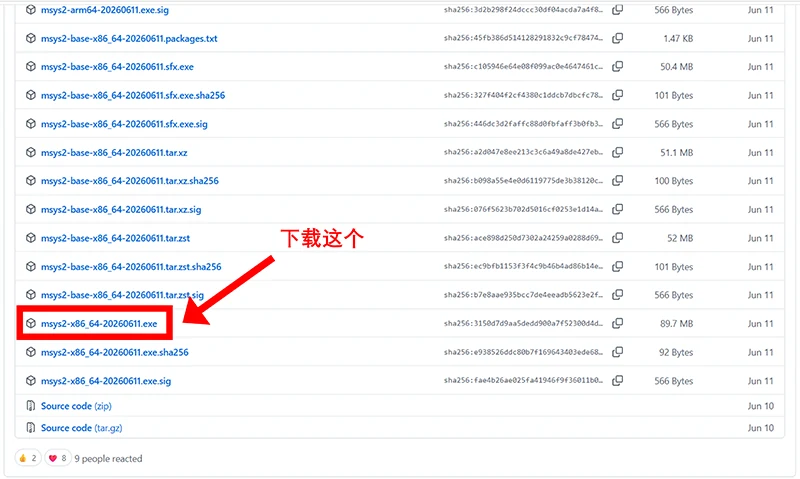

##### msys2 安装

双击 `msys2-x86_64-20260611.exe` 运行安装程序

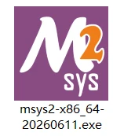

安装向导首页直接点击「下一步」

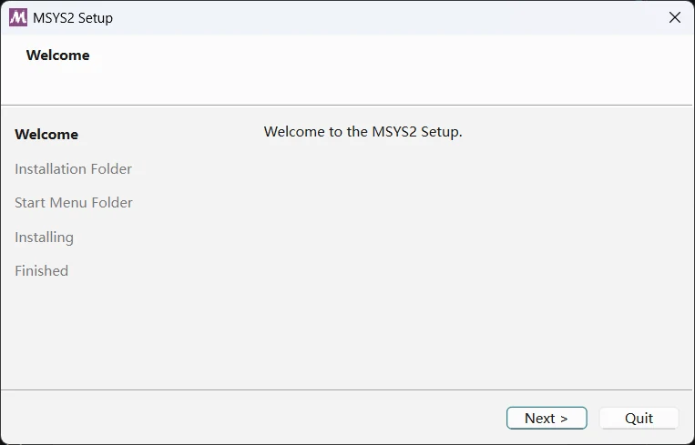

选择安装路径，我们使用默认路径 `C:\msys64`，也可根据磁盘空间自定义位置，确认后点击「下一步」

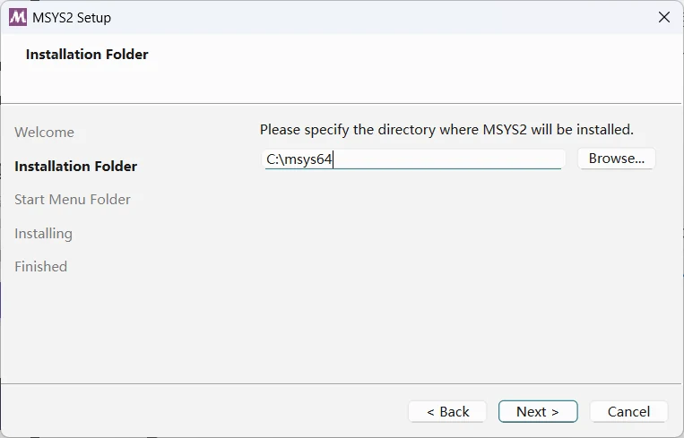

这里保持默认，点击「下一步」

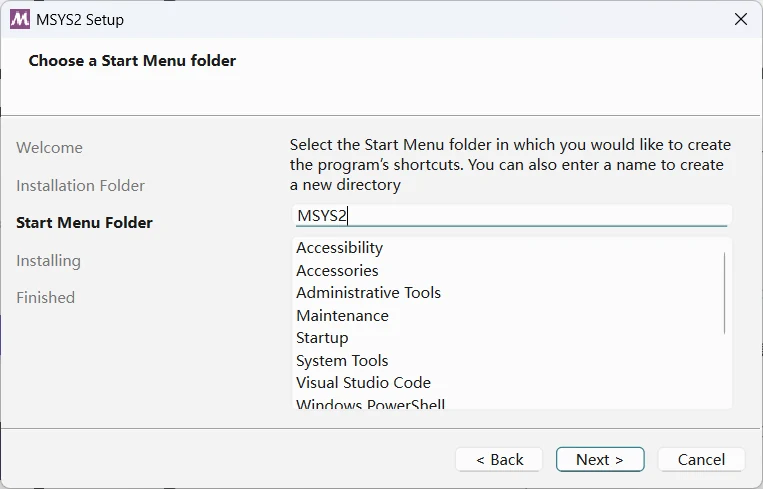

等待安装完成，点击「下一步」

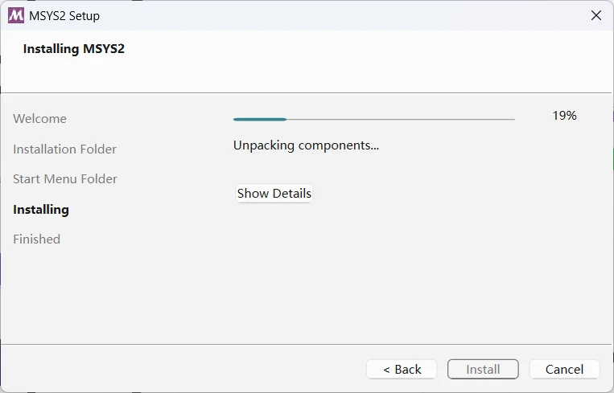

勾选`立即运行 MSYS2`，点击「完成」，会自动弹出 msys2 终端窗口

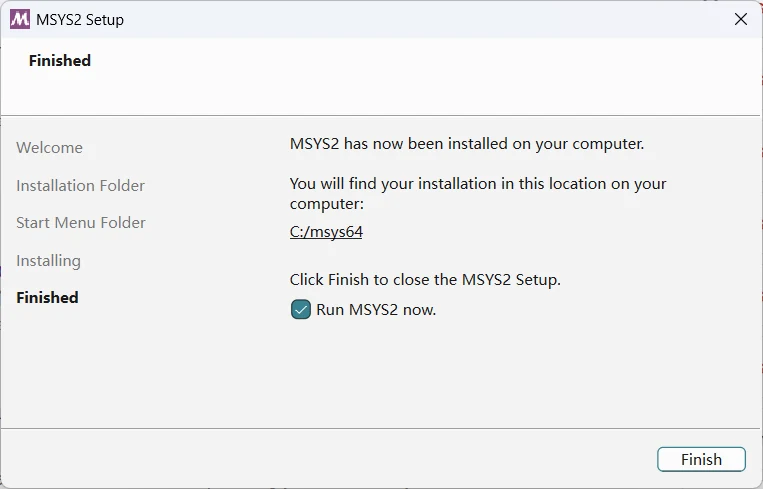


> [!NOTE]
> msys2 终端窗口中的快捷键：
> - Tab：自动补全文件名或命令
> - Ctrl + C：中断正在运行的命令
> - Ctrl + L：清除屏幕
> - Ctrl + R：搜索命令历史
> - 向上箭头：从历史记录中调用上一个命令
> - 向下箭头：从历史记录中调用下一个命令
> - 向左箭头：将光标向左移动一个字符
> - 右箭头：将光标向右移动一个字符
> - **Ctrl + Ins**：复制（window是 Ctrl + C）
> - **Shift + Ins**：粘贴（window是 Ctrl + V）

##### MinGW-W64 安装、配置环境变量

###### 安装编译工具链

> [!TIP]
> **建议先修改下载源为清华源**
> - 方法一：手动添加
>  ```
>   # 文件 "C:\msys64\etc\pacman.d\mirrorlist.msys" 开头添加
>   Server = https://mirrors.tuna.tsinghua.edu.cn/msys2/msys/$arch
>   # 文件 C:\msys64\etc\pacman.d\mirrorlist.mingw 开头添加
>   Server = https://mirrors.tuna.tsinghua.edu.cn/msys2/mingw/$repo/
>   ```
> - 方法二：在msys2终端中直接输入以下命令
>  ```bash
>   # 在 mirrorlist.msys 文件开头插入清华MSYS源
>   sed -i '1i\Server = https://mirrors.tuna.tsinghua.edu.cn/msys2/msys/$arch' \
>           /etc/pacman.d/mirrorlist.msys
>   # 在 mirrorlist.mingw 文件开头插入清华MINGW源
>   sed -i '1i\Server = https://mirrors.tuna.tsinghua.edu.cn/msys2/mingw/$repo/' \
>           /etc/pacman.d/mirrorlist.mingw
>   ```
> 
> 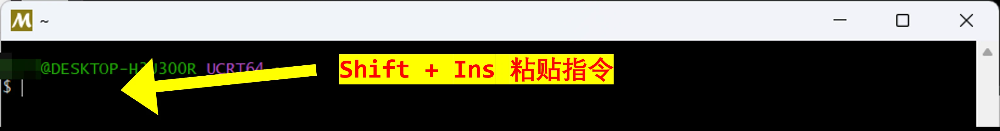
> 
> 两者效果是一致的😄

在 msys2 终端窗口中，输入以下命令，安装完整的 MinGW-W64 工具链：

```
pacman -S --needed base-devel mingw-w64-ucrt-x86_64-toolchain
```

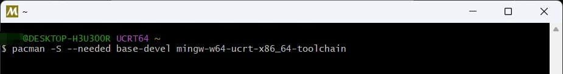

出现包选择提示时，直接按回车，默认安装全部组件


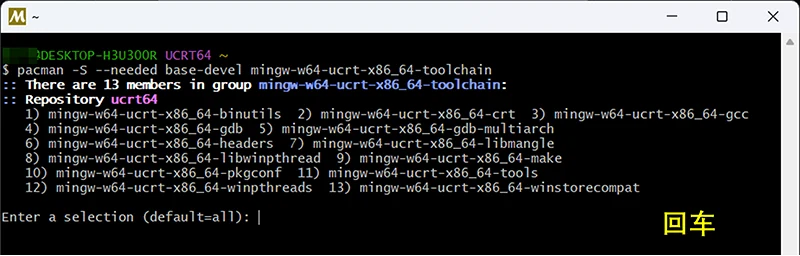

系统询问是否继续安装时，输入 `y` 并回车


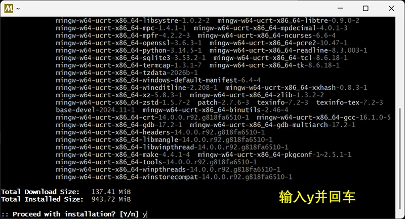

等待所有包安装完成后，关闭终端窗口即可


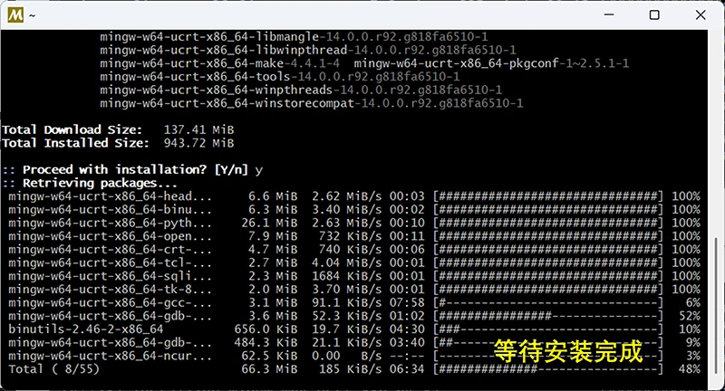

###### 配置系统环境变量

我们需要把编译器的路径加入系统环境变量，这样在任意位置都能调用 gcc 命令：

1. 打开 msys2 的安装目录，依次进入 `ucrt64` → `bin` 文件夹，复制地址栏中的路径
如果使用默认安装路径，完整路径为 `C:\msys64\ucrt64\bin`

2. 打开设置 → 系统 → 关于 → 高级系统设置 → 环境变量

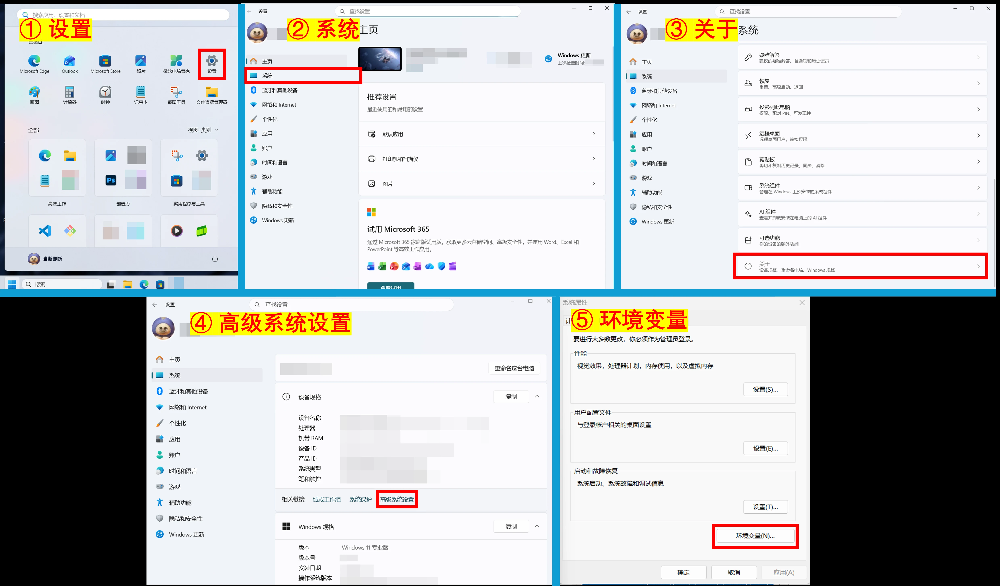

3. 在「系统变量」列表中找到 `Path`，双击打开编辑窗口

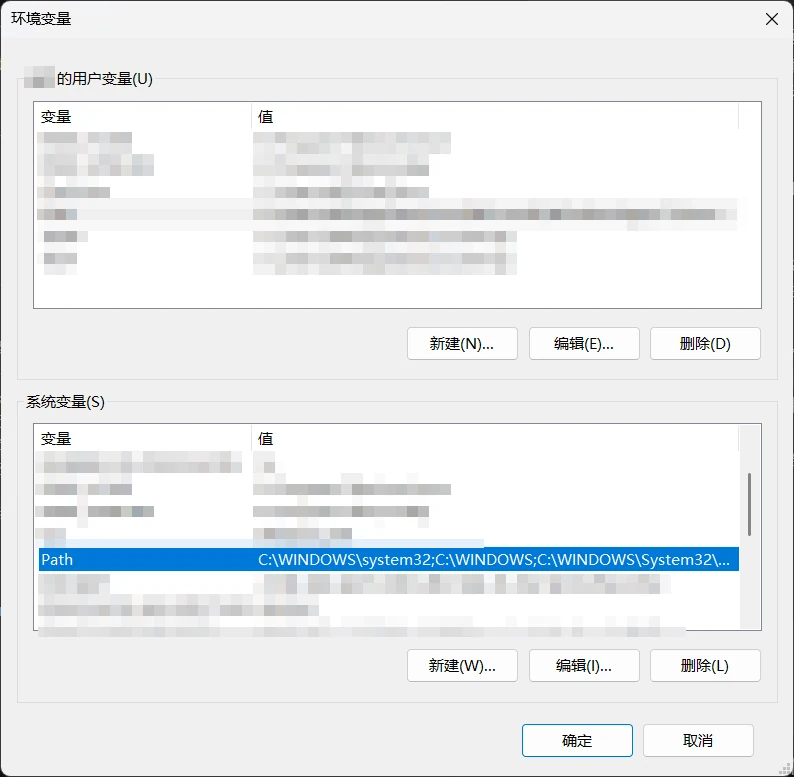

4. 点击「新建」，粘贴刚才复制的 `bin` 目录路径，点击「确定

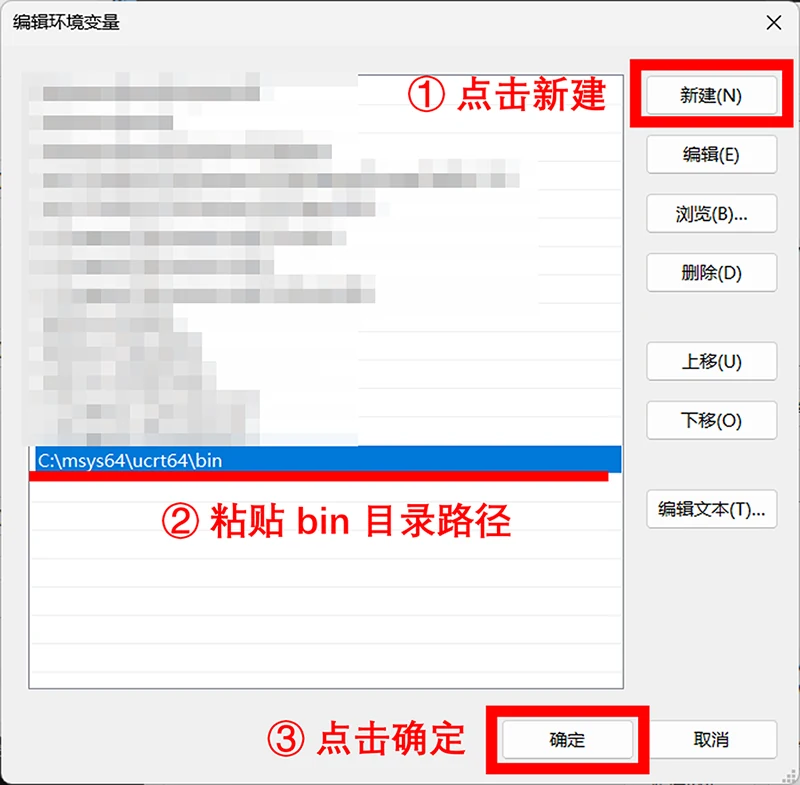

5. 逐层点击「确定」，关闭所有设置窗口

###### 验证安装是否成功

按下 `Win + R`，输入 `cmd` 并回车，打开命令提示符窗口，依次执行以下三条命令：
```
gcc --version
g++ --version
gdb --version
```

如果三条命令都能正常输出版本号信息，说明 MinGW-W64 编译环境已经安装配置成功

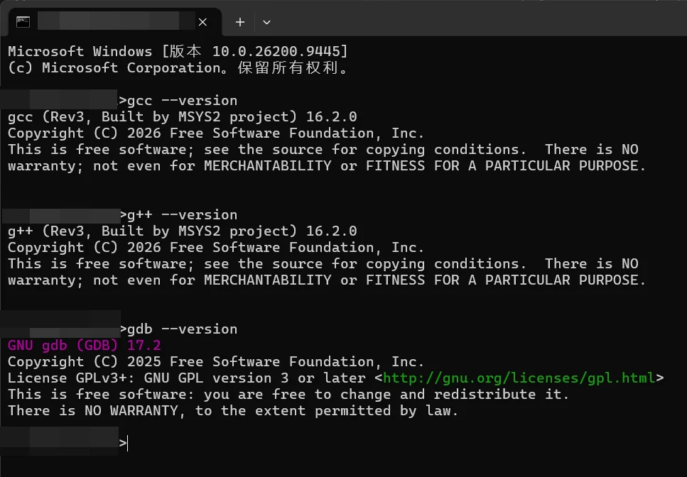

### 配置 vscode 的 C/C++ 开发环境

#### 1. 中文语言包（可选）

对自己英语水平没有把握的麻瓜，官方还贴心地准备了简体中文语言包：

1. 启动 vscode，打开扩展面板
2. 在搜索框输入 `Chinese`，找到「Chinese (Simplified) (简体中文) Language Pack for Visual Studio Code」插件
3. 点击「Install」安装，完成后右下角会弹出重启提示
4. 点击「Change Language and Restart」，软件重启后即为中文界面


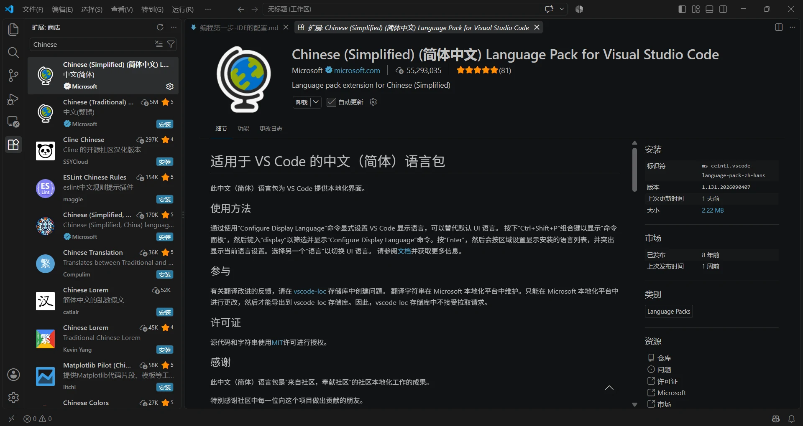

#### 2. 安装 C/C++ 核心扩展

vscode 本身只是个加强版的记事本，要想便捷地进行 C/C++ 开发，需要安装扩展，以此来支持语法高亮、快速的编译与调试：

1. 在扩展面板，搜索关键词 `C/C++`
2. 找到微软官方发布的「C/C++」与「C/C++ Extension Pack」扩展，点击「安装」


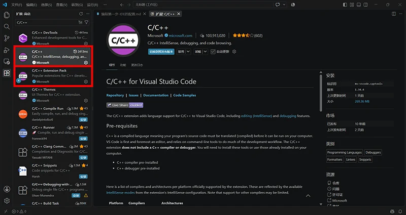

### 测试你的第一个 C 程序

#### 1. 创建工作文件夹

vscode 以「文件夹」为单位管理代码项目，我们先创建专属的工作目录：

- 在电脑合适的位置新建文件夹，用于存放本课程的项目代码（按照个人喜好进行命名，例如 `Programming` 等）
- 在其中创建一个 `202609XX_test` 项目文件夹，用于存放今天的测试代码（这里习惯命名为 `日期_项目名`）
    > [!WARNING]
    > 文件夹的完整路径中**不要包含中文和空格**，否则可能导致编译失败
- 打开 vscode，点击「文件」→「打开文件夹」，选中刚才创建的文件夹
- 弹出信任作者提示时，勾选「信任此文件夹中所有文件的作者」，点击「是，我信任此作者」

#### 2. 单个 .c 文件的运行与调试

我们先写一个简单的程序，验证环境是否正常工作：

1. 在左侧资源管理器的 `202609XX_test` 文件夹上，右键，新建文件 `test.c`
2. 在 `test.c` 中输入以下测试代码：
    ```c
    #include <stdio.h>

    int main() {
        printf("Hello world!\n"); 
        return 0;
    }
    ```
    该程序会输出字符串 `Hello world!`

3. 点击页面右上角「调试C/C++文件」，在弹出的编译器选项中，选择第一个，也就是我们之前安装的 gcc
4. 程序会自动完成编译并运行，在下方的终端窗口中可以看到程序的输出结果
5. 在文件夹下会生成一个 `test.exe` 可执行文件，双击后可以运行
6. 同目录下会生成一个 `.vscode` 文件夹，该文件夹内会存放配置文件。


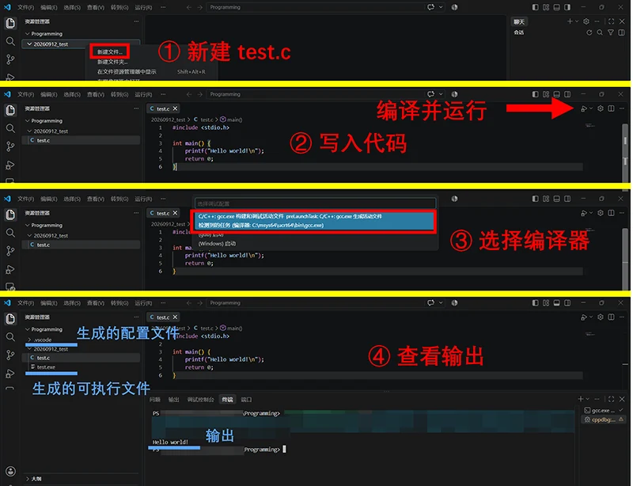

##### * 断点调试入门

vscode 提供了可视化的调试功能，我们新建一个文件 `test_breakpoint.c` 来演示：
```c
#include <stdio.h>
int main() {
    printf("当破即破！\n");
    printf("当断即断！\n");
    printf("当弃即弃！\n");
    printf("剑招千遍，其势自明！\n");
    return 0;
}
```

- 点击代码行号左侧的空白处，可以添加或取消断点（断点会以红点标记）
- 启动调试后，程序会自动停在第一个断点处
- 调试面板的按钮功能：（按图中顺序从左往右）
  - **继续`F5`**：继续运行程序，直到遇到下一个断点或程序结束
  - **逐过程`F10`**：逐行执行代码，遇到函数调用时直接执行完，不进入函数内部
  - **单步调试`F11`**：逐行执行代码，遇到函数调用时会进入函数内部
  - **单步跳出`Shift + F11`**：执行完当前函数的剩余代码，回到函数被调用的位置
  - **重启`Ctrl + Shift + F5`**：重新开始当前调试会话
  - **停止`Shift + F5`**：结束调试，关闭正在运行的程序


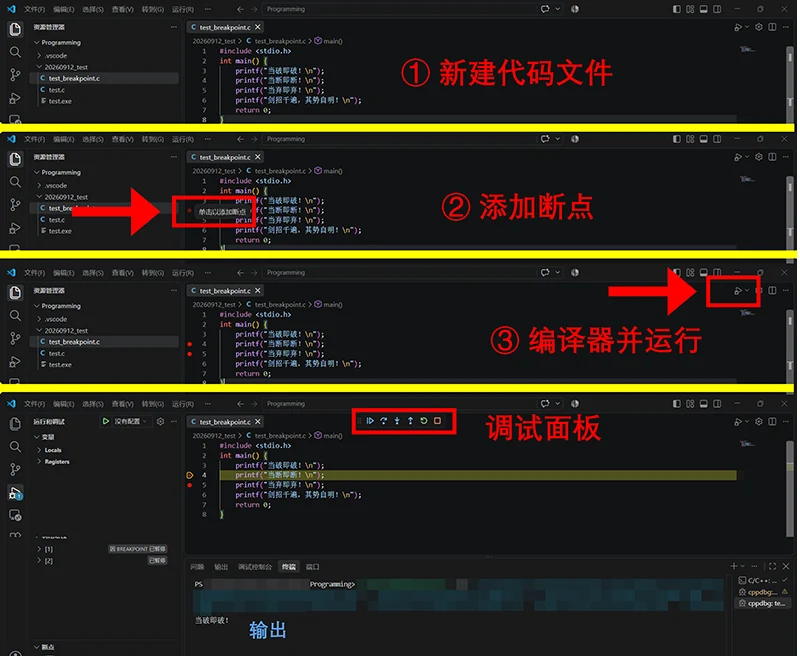

#### * 3. 修改 C/C++ 编译标准

C 和 C++ 都不是“固定不变”，它们经历了多次标准化。不同标准支持的语法不同，编译器默认采用的标准也不同。

> [!NOTE]
> `//` 注释和 `for (int i = 0; ...)` 是 **C99** 才正式支持的
> `auto`、`范围 for`、`智能指针`是 **C++11** 才正式支持的
> `concepts`、`ranges`、`std::format` 是 **C++20** 才支持的

如果不显式指定编译标准，GCC 会使用一个默认值。不同版本 GCC 的默认标准可能不同，这会导致同一份代码在你电脑上能编译，在别人电脑上却报错。
因此，建议在 `tasks.json` 中明确写出 `-std=...`。

##### 常用 C 语言标准

| 标准 | 发布年份 | 别名 | 核心新增特性 |
|------|---------|------|-------------|
| C89/C90 | 1989/1990 | ANSI C / ISO C | 首个正式标准，奠定 C 语言基本语法 |
| C99 | 1999 | — | `//` 注释、`for` 内声明变量、`_Bool`、变长数组、`long long`、指定初始化器 |
| C11 | 2011 | — | `_Generic`、`_Static_assert`、`_Atomic`、匿名结构体/联合体 |
| C23 | 2024 | — | `bool`/`true`/`false`、`constexpr`、`typeof`、`nullptr` |

##### 常用 C++ 标准

| 标准 | 发布年份 | 核心新增特性 |
|------|---------|-------------|
| C++98 | 1998 | 首个 ISO C++ 标准，类、继承、模板、STL |
| C++11 | 2011 | `auto`、范围 `for`、智能指针、lambda、右值引用 |
| C++17 | 2017 | 结构化绑定、`if constexpr`、`std::variant`、`std::string_view` |
| C++20 | 2020 | 概念、范围、模块、协程、三路比较 `<=>`、`std::format` |
| C++23 | 2023 | `std::expected`、`std::flat_map`、`std::print`、多维 `operator[]` |

> [!TIP]
> - 不过我们也会看到 `ISO` 之外的另一类标准 `GNU`
> - `GNU` 基于 `ISO`，并进行了扩展，添加了 `GCC` 提供的一些非标准功能和扩展（我们安装的就是 `GCC`）

#####  配置编译标准

- `c_cpp_properties.json` 决定 vscode 的语法检查、代码补全和悬停提示使用哪个标准
    1. 按下 `Ctrl + Shift + P`
    2. 输入 `C/C++: Edit Configurations (UI)`
    3. 在界面中设置：
        - C Standard：C语言标准
        - C++ Standard：C++标准
    
    
    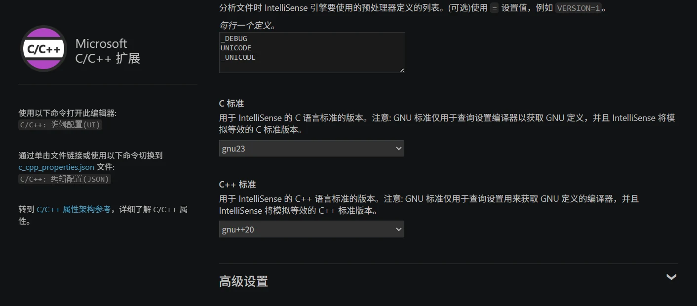
    
- `tasks.json` 决定实际编译的标准
    我们通过制定 `-std=...` 参数来设定使用的编译标准
    下图设定了编译标准为 `c17`
    
    
    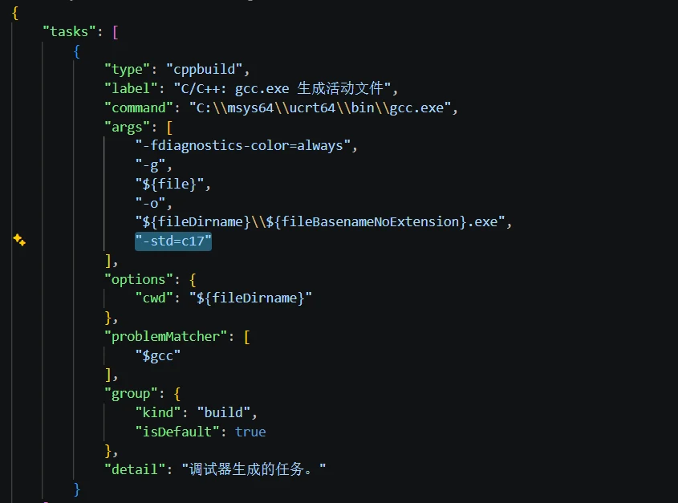
    
##### 验证当前编译标准

C 语言可以用 `__STDC_VERSION__` 查看当前标准：
```c
#include <stdio.h>

int main() {
#ifdef __STDC_VERSION__
    printf("C standard: %ld\n", __STDC_VERSION__);
#else
    printf("C89 or earlier\n");
#endif
    return 0;
}
```
输出：
- `C++98` → `199711`
- `C++11` → `201103`
- `C++14` → `201402`
- `C++17` → `201703`
- `C++20` → `202002`
- `C++23` → `202302`

而 C++ 可以用 `__cplusplus` 查看（在此不做演示）

有兴趣的同学可以体验一下下面的代码，观察不同标准的 C 行为差异：

- 示例 1：C99 的 `//` 注释与 `for` 内声明变量
    ```c
    #include <stdio.h>

    int main() {
        // 这是 C99 才支持的 // 风格注释
        for (int i = 0; i < 3; i++) {   // C99 允许在 for 内声明 i
            printf("i = %d\n", i);
        }
        return 0;
    }
    ```
    -std=c89 → 编译失败，C89 不支持 `//` 注释，也不允许在 for 内声明变量
    -std=c99 或更高 → 编译成功，输出三行 `i = 0/1/2`

- 示例 2：C11 泛型选择表达式 与 匿名结构体
    ```c
    #include <stdio.h>

    #define TYPE_NAME(x) _Generic((x), \
        int: "int", \
        double: "double", \
        float: "float", \
        default: "unknown")

    int main() {
        int i = 10;
        double d = 3.14;
        float f = 2.5f;

        printf("i 的类型: %s\n", TYPE_NAME(i));
        printf("d 的类型: %s\n", TYPE_NAME(d));
        printf("f 的类型: %s\n", TYPE_NAME(f));

        // 匿名结构体/联合体
        struct {
            int type;
            union {
                int i;
                float f;
            };  // 匿名联合体
        } value;

        value.type = 1;
        value.i = 42;
        printf("type = %d, i = %d\n", value.type, value.i);

        return 0;
    }
    ```

    其实哪怕设置 `-std=c99`，`GCC` 也是能编译成功这段代码的。
    哇呼！恭喜你发现了盲点！（库特举手）
    虽然匿名结构体和联合体在 **C11** 中才被标准化，但 `GCC` 很早就以 `GNU` 扩展的形式支持它们了。
    ```
    // GCC 官方文档：
    As permitted by ISO C11 and for compatibility with other compilers, GCC allows you to define a structure or union that contains, as fields, structures and unions without names.
    ```
    `GCC` 出于兼容性考虑，在 **C99** 甚至 **C89** 模式下也允许匿名结构体，同样不会主动报错。
    快穿上西装对 `GCC` 说谢谢！！！

    如果你想要 `GCC` 严格按照设定的 C 标准，需要增加 `-pedantic-errors` 参数，此时会得到输出如下：

    
    
    
- 示例 3：C23 的 auto 类型推导
    ```c
    #include <stdio.h>

    int main() {
        auto x = 42;          // C23 中 auto 推导为 int
        auto y = 3.14;        // 推导为 double
        auto z = 'A';         // 推导为 char
        auto sum = x + y;     // 推导为 double

        printf("x = %d\n", x);
        printf("y = %f\n", y);
        printf("z = %c\n", z);
        printf("sum = %f\n", sum);

        return 0;
    }
    ```

    其实 `auto` 是 C++ 标准支持的，不过现在现代 C 也把它加进去了。u1s1 个人觉得这个和 C 本身简洁的风格不太符合。

## Codeblocks 篇

当然你们平时写作业与上机测试更常用的是 Codeblocks。

### 软件的安装

我们给出了 Codeblocks 免安装版本的压缩包，直接解压到你希望的位置

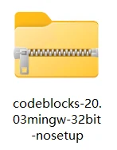

打开 `codeblocks-20.03mingw-32bit-nosetup` 文件夹，双击打开 `codeblocks.exe`

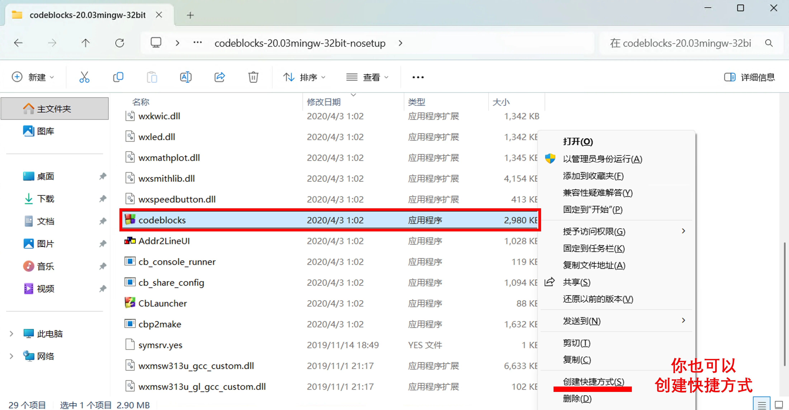

这里会检测你电脑自带的编译器，我们什么都不用管，点击「OK」

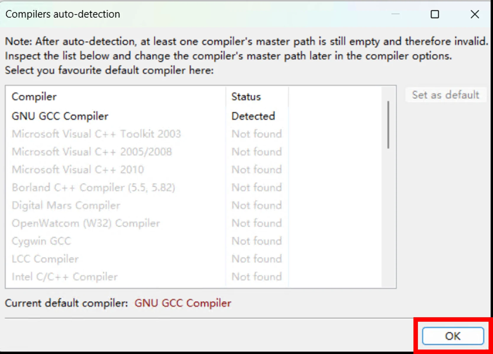

什么都不用管，点「OK」

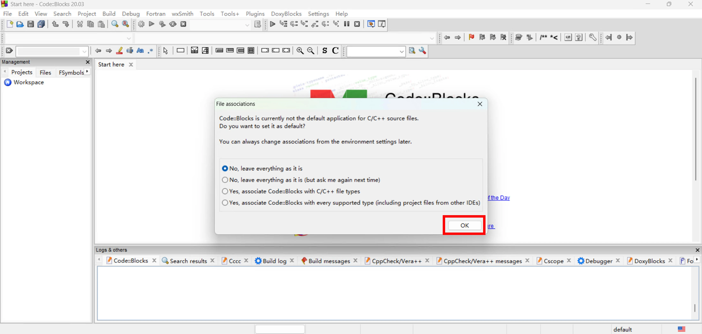

### 测试你的第一个 C 程序

点击 `File` → `New` → `Project...`

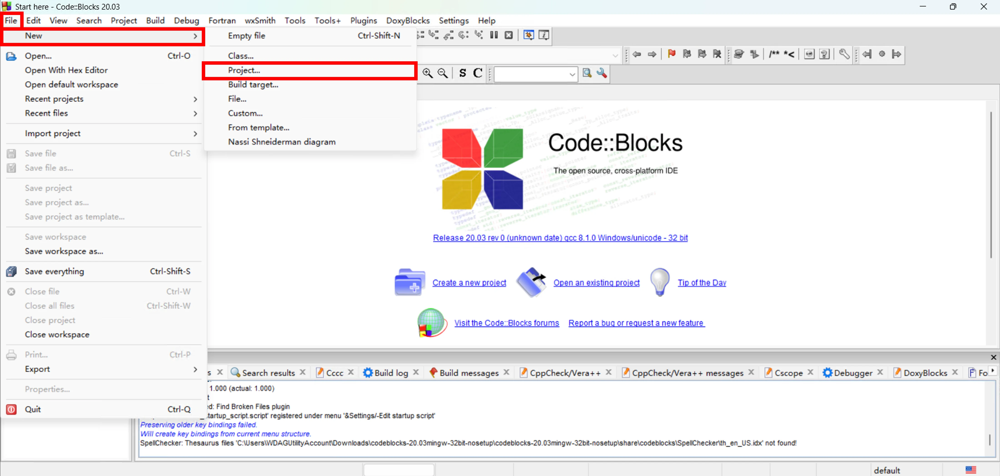

选择 `Console application`，点击 「Go」

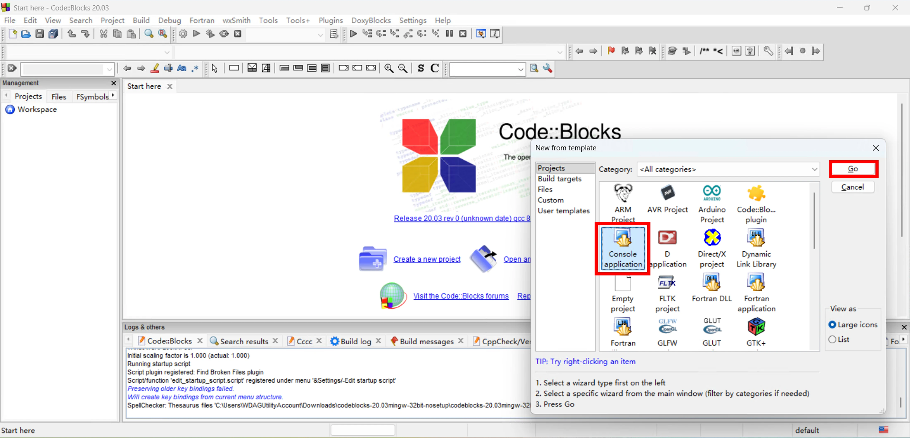

点击「Next」

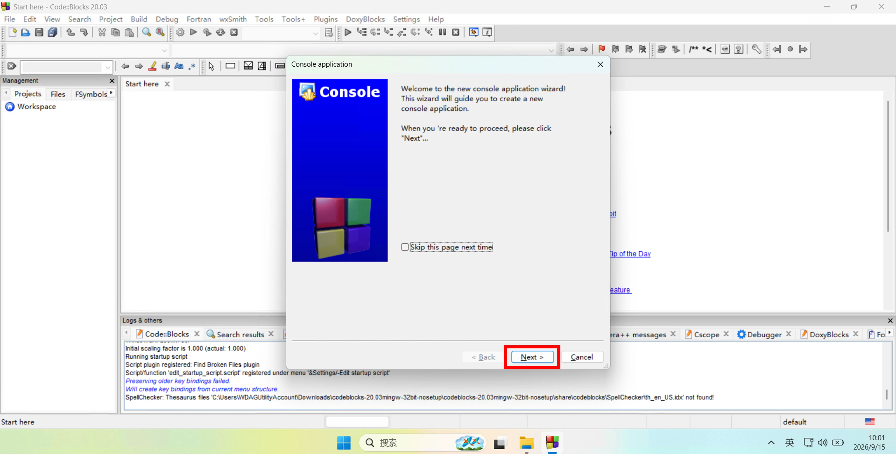

选择 C，点击「Next」

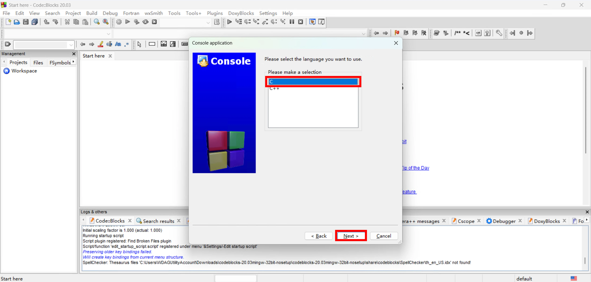

设定项目名称和项目文件夹路径

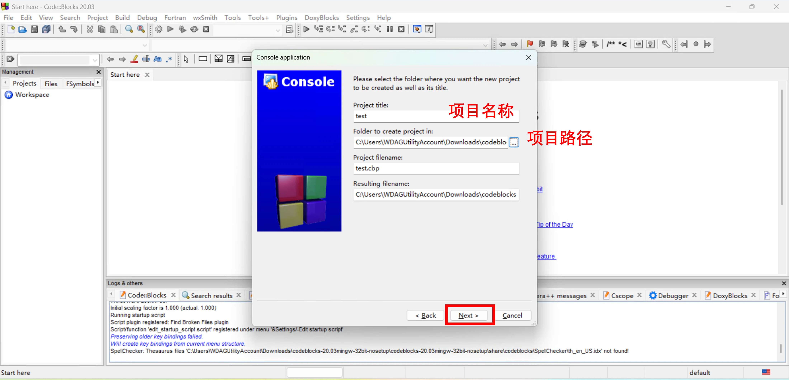

点击「Next」

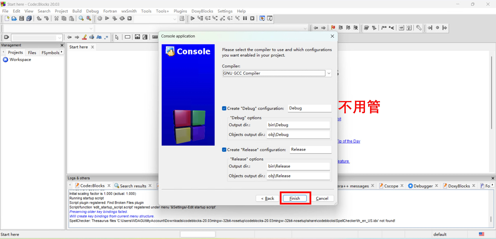

我们得到了一个默认的 C 语言控制台应用程序项目，点击「编译并运行」按钮

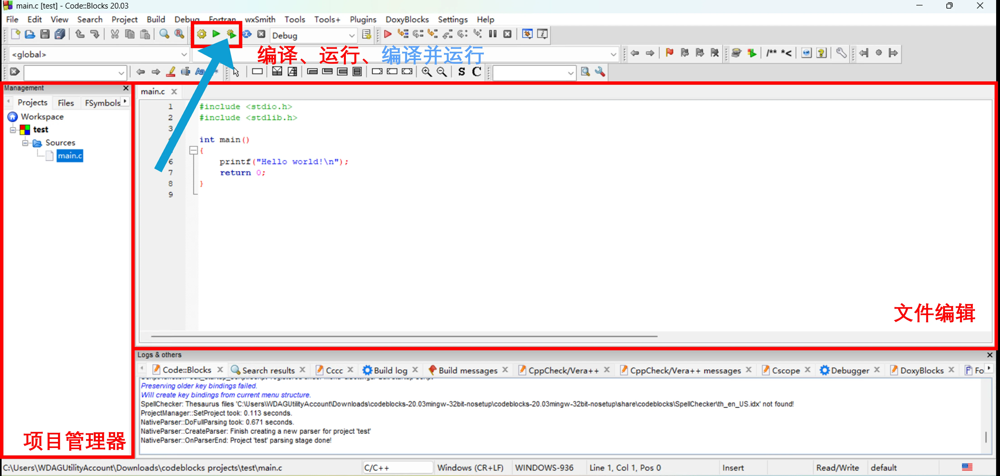

我们可以看到如下的输出

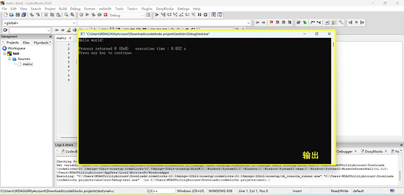

##### 修改 C/C++ 标准

codeblocks 也是能够修改使用的编译标准的。
点击 Settings → Compiler，选择对应的标准即可。

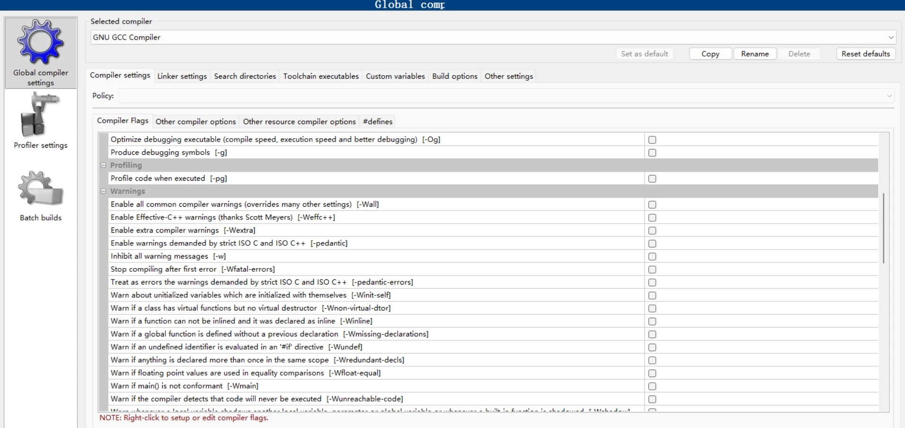

因为我们提供的 codeblocks 内置了 MinGW，所以配置很方便。
各位写作业和考试可以使用。

## Trae 插件

在 vscode 的插件市场中，搜索 Trae 并安装


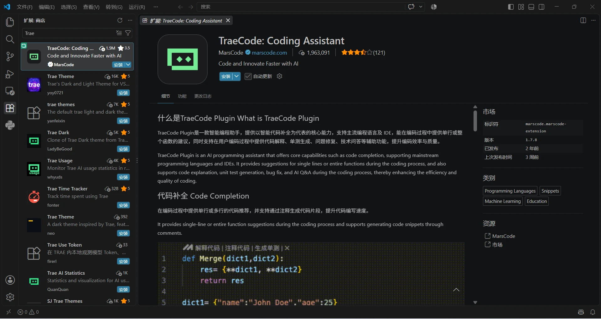

首次启动 Trae 时，按照向导登录账号即可

Trae 的 AI 辅助功能（摘录自 Trae 插件介绍）：

##### 代码补全 Code Completion

在编码过程中提供单行或多行的代码推荐，并支持通过注释生成代码片段，提升代码编写速度。

##### 代码解释 Code Explain

精确解释项目代码，帮助开发人员快速熟悉项目。

##### 智能修复 AI Fix

一键修改代码bug，提升代码修复效率。

##### 智能问答 AI Q&A

针对研发领域定向优化问答质量，提供更精准的问答结果。

##### Workspace

作为您的全仓库智能助手，提供全局代码理解和上下文感知能力。可用于快速了解项目结构和代码组织、理解复杂变量和函数之间的关系等。

详细的功能可以查看 Trae 的手册，[https://docs.trae.cn/plugin/faq](https://docs.trae.cn/plugin/faq)


> [!WARNING]
> AI 生成的代码不一定正确，写作业时请不要过度依赖。把 Trae 当作学习辅助工具，而不是代写工具。


当然 Trae 也有完整 IDE 的版本，可以从官网下到：
Trae 国内版官网：https://www.trae.cn/  ← 国内使用这个
Trae 国际版官网：https://www.trae.ai/


---
## 趣味小游戏：

既然环境搭好了，那我们就来体验一下 C 语言能做到什么吧。
助教这里准备了小游戏给大家体验。

### 贪吃蛇

下载并编译助教提供的 <a :href="$withBase('/downloads/snake.c')" download>snake.c</a>，游玩经典游戏回味童年。

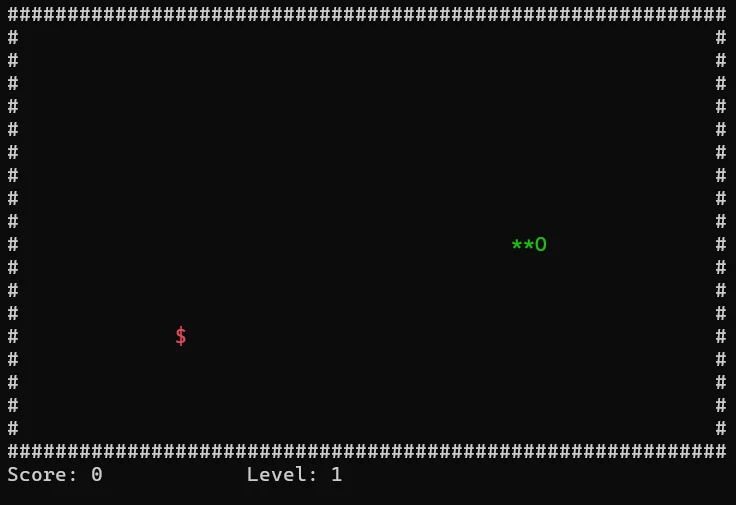

### 吃豆人

下载并编译助教提供的 <a :href="$withBase('/downloads/pacman.c')" download>pacman.c</a>，游玩经典游戏回味童年。

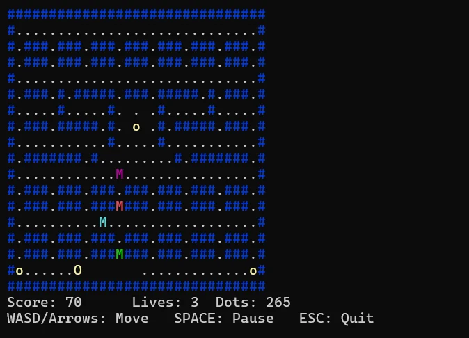

当然现在的游戏开发会使用游戏引擎，能够更方便地开发更强大的游戏。上面演示的两个小游戏属于是离经叛道的做法。
日后感兴趣的同学可以自学游戏引擎的使用（常见的 Unity / Unreal），尝试着构建自己的小游戏。


## 结语

祝贺你走到这里！你已经成功从零搭建好了完整的 C/C++ 开发环境，并且运行了属于自己的第一个程序。

当然编程的路很长，环境配置只是万里长征的第一步。接下来你会接触到变量、函数、指针、结构体等等知识，也会遇到各种各样的 bug。

不用害怕出错，也不用纠结是不是“最好的”。对于新手来说，能跑起来、能写代码、能看到运行结果，就是最好的开始。从一行行代码里慢慢积累，你会逐渐感受到编程的乐趣与魅力。

最后助教送你们一个祖传的秘籍注释：佛祖保佑，代码能run，程序能work。

```c
/*
                   _ooOoo_
                  o8888888o
                  88" . "88
                  (| -_- |)
                  O\  =  /O
               ____/`---'\____
             .'  \\|     |//  `.
            /  \\|||  :  |||//  \
           /  _||||| -:- |||||-  \
           |   | \\\  -  /// |   |
           | \_|  ''\---/''  |   |
           \  .-\__  `-`  ___/-. /
         ___`. .'  /--.--\  `. . __
      ."" '<  `.___\_<|>_/___.'  >'"".
     | | :  `- \`.;`\ _ /`;.`/ - ` : | |
     \  \ `-.   \_ __\ /__ _/   .-` /  /
======`-.____`-.___\_____/___.-`____.-'======
                   `=---='
^^^^^^^^^^^^^^^^^^^^^^^^^^^^^^^^^^^^^^^^^^^^^
            佛祖保佑       永无BUG
*/
```